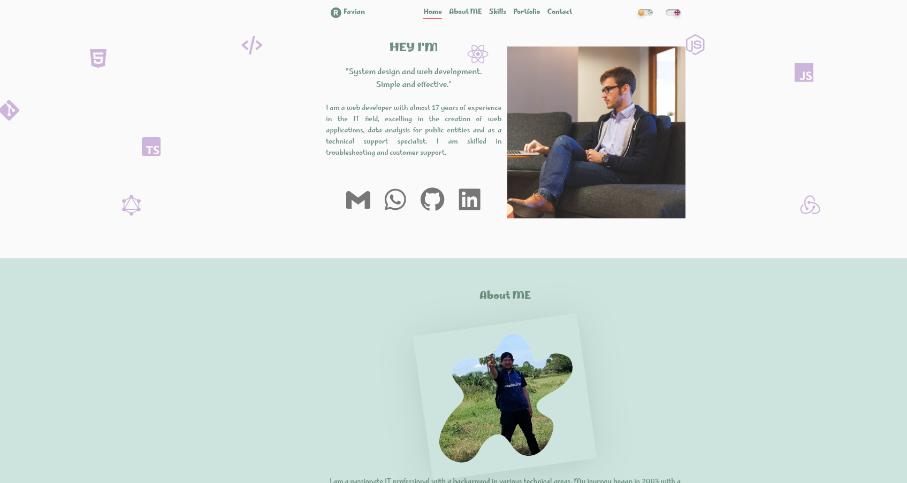

#  Aplicacion responsiva con html css y JS
## Aplicación web adaptable con modo oscuro/claro, multilingüe (inglés/español) y envío de correos. Personalizada con CSS (menús, tarjetas, galería).

### Descripcion

Este proyecto implementa mi Curriculm con frontend responsive (HTML, CSS, JavaScript), ofreciendo una interfaz intuitiva y adaptable a diferentes dispositivos. Incluye funcionalidades como modo oscuro, carga dinámica, soporte para múltiples idiomas y envío de formularios. Utiliza CSS personalizado para crear un diseño atractivo y coherente, y JavaScript para agregar interactividad y mejorar la experiencia del usuario, fuente google fonts, variables CSS, finalmente tiene validacion del formulario con mensajes de error para cada campo.

Puedes visitar la plataforma en línea en https://academlo-cv-fmg-page.vercel.app/

## Caracteristicas

- **Responsiva: ** Aplicación web responsiva con modo claro multi idioma  Variables CSS
- **BEM: ** Metodología BEM (Block Element Modifier)
- **Dinamismo ** Animaciones y Transiciones
- **Dark Mode** Soporte para Dark Mode/Light
- **Multi Lenguaje:** Permite cambiar a Ingles/Español
- **EmailJS** Integración para enviar correos electrónicos (EmailJS) directamente desde  Formulario Interactivo que Permite el enviar de mensajes directamente a través de un formulario.
- **Animate.css:** Biblioteca para animaciones CSS, permite agregar efectos visuales a los elementos de la página.
- **Boxicons: **Conjunto de iconos vectoriales en  íconos atractivos.
- **Menu responsivo:** Navbar Responsiva
- **Pestañas: ** Utiliza plantillas HTML ocultas para mostrar diferentes categorías en uso de pestañas (TABs)
- **Fuentes: ** Fuentes de Google Fonts (Personalizadas) para mejorar la tipografía y la estética general.
- **SEO:** Optimización SEO (Meta Tags) Uso de etiquetas meta para mejorar el SEO, incluyendo descripción, palabras clave y autor.
- ** Accesibilidad:** Accesibilidad Uso de etiquetas semánticas Estructura del documento clara que mejora la accesibilidad para lectores de pantalla

### Requisitos del Sistema

- **Sistema Operativo**: Ubuntu 22.04.4 LTS
- **Kernel**: Version 6.2.16-3-pve
- **NodeJS**:  20.17
- **npm/npx**: 10.8.4

Sistemas Alternativos Probados

El proyecto también ha sido probado en el siguiente entorno alternativo:

- **Sistema Operativo**: Windows 10 Pro 1803
- **NodeJS**:  18.20.4
- **npm/npx**: 18.20.4

 

## Comandos utiles
*Ver la versión del kernel:

uname -r

*Ver información del sistema:

sb_release -a

node -V

npm -v
